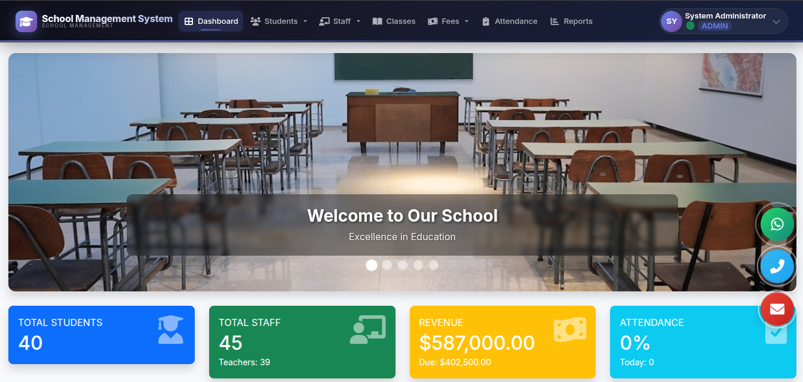
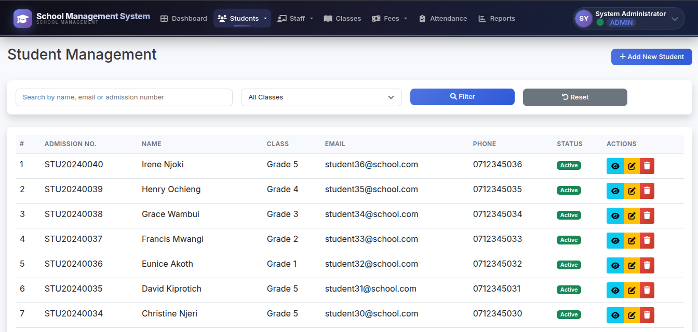
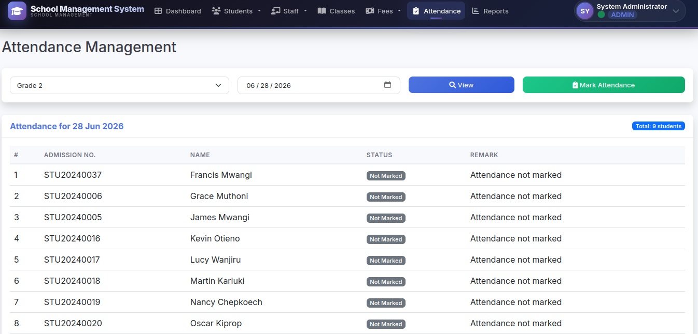

# 🏫 School Management System

A comprehensive school management system built with PHP, MySQL, and Bootstrap. Perfect for managing students, staff, fees, attendance, and more.

## 🚀 Live Demo

**[View Live Website](https://michaelphotofolio.atwebpages.com/schoolmanagement/)**

> **Demo Credentials:**
> - Username: `admin`
> - Password: `password`

## 📸 Screenshots

### Dashboard

### Student Management

### Fee Management

### Attendance Tracking

## ✨ Features

- ✅ **Student Management** - Add, edit, delete, and view students
- ✅ **Staff Management** - Manage teachers and staff members
- ✅ **Class Management** - Create and manage classes
- ✅ **Fee Management** - Generate and track fee payments
- ✅ **Attendance System** - Mark and view student attendance
- ✅ **Reports Generation** - Generate various reports
- ✅ **Admin Dashboard** - Statistics and quick actions
- ✅ **Responsive Design** - Works on all devices

## 💻 Tech Stack

| Category | Technology |
|----------|------------|
| **Frontend** | HTML5, CSS3, Bootstrap 5, JavaScript |
| **Backend** | PHP |
| **Database** | MySQL |
| **Hosting** | AwardSpace |
| **Libraries** | jQuery, DataTables, Chart.js, Font Awesome |

## 📂 Project Structure
